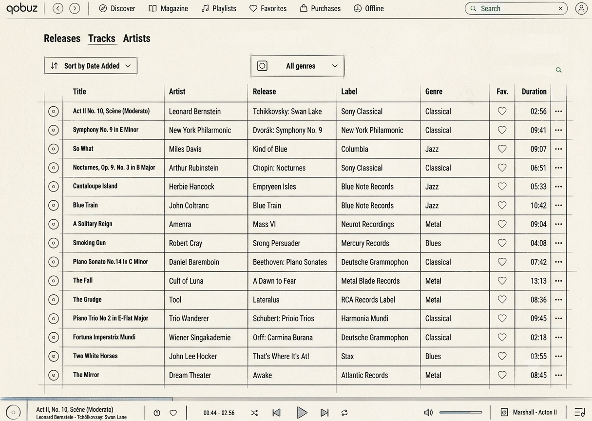
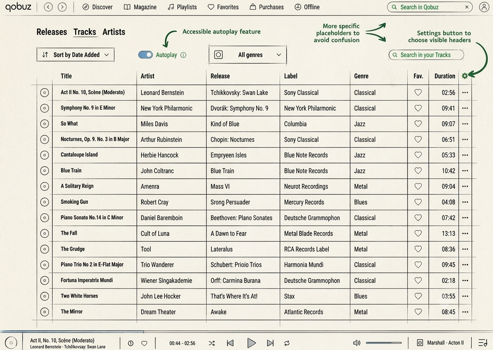
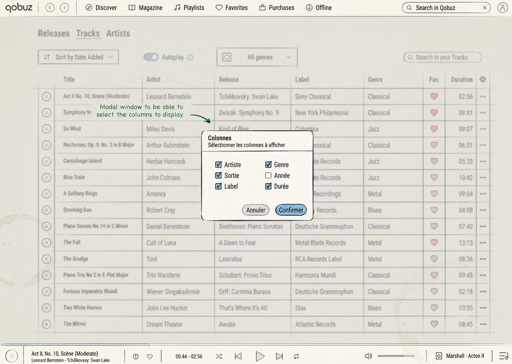
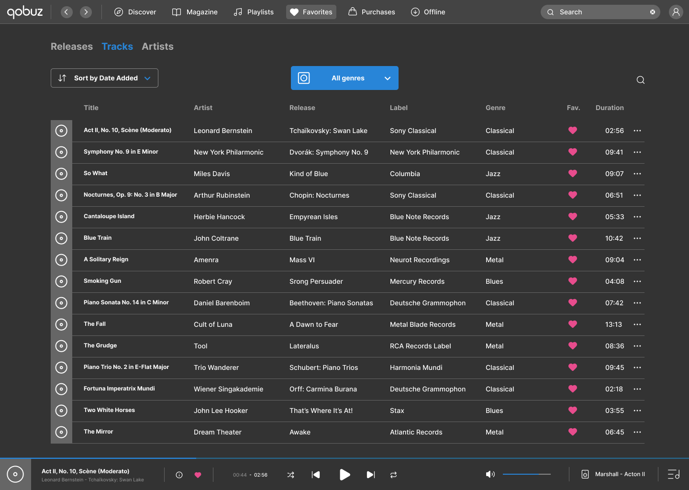
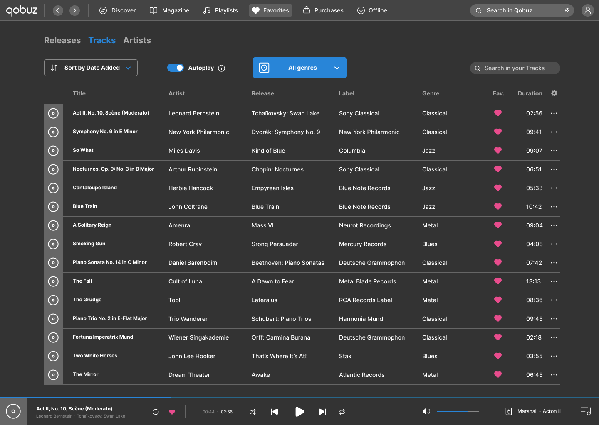
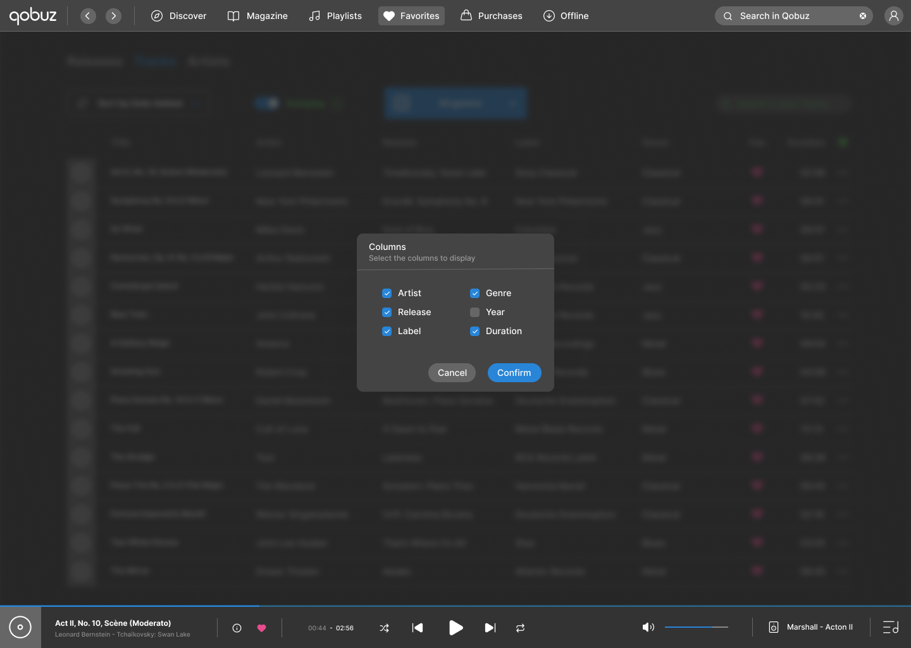

# Designer Language

> **IMPORTANT NOTE**
> 1. This document was written as part of a UX Design assignment for [Holberton School](https://www.holbertonschool.fr).
> 2. The assignment was originally intended to be completed using **Spotify**, but I deliberately chose to apply it to the [Qobuz](https://www.qobuz.com/fr-fr/discover) streaming platform instead, for the following reasons:
>     - The assignment is not up to date with Spotify's current interface, and most of the issues mentioned are now outdated or have already been addressed.
>     - Qobuz is a newer platform that offers more oportunities for meaningful user experience improvements.
>     - For ethical reasons related to **artist revenue**, **AI-generated content** and **financial involvment in the military industry**, I prefer not to promote Spotify in any way.
> 3. Because of this change of platform, I slightly adpated the **User Journey** to fit Qobuz's interface.

## Summary

- [1. Assignment](#1-assignment)
- [2. Persona Definition](#2-persona-definition)
- [3. User Journey](#3-user-journey)
- [4. UX Analysis & Exploration](#4-ux-analysis--exploration)
- [5. Final Design Mockups](#5-final-design-mockups)

## 1. Assignment

Based on a predefined **Persona** and their **User Journey**, the objective of this assignment is to identify usability issues, propose interface improvements addressing those problems, translate those ideas into research sketches, and finally realistic mockups using **Figma**.

## 2. Persona Definition

First, let's define a **Persona**, representing a fictional user through a *Profile* and a *Story*, as well as their *Goals*, *Needs*, *Wants* and *Fears*.

### Profile & Story

- **Name**: Regina
- **Age**: 68
- **Location**: Fort Myers, FL
- **Music Expertise**: 3/3
- **Software Expertise**: 1/3
- **Current Occupation**: retired truck driver
- **Education**: bachelor of music

After studying music to become an Opera singer, Regina quickly realized that she wouldn't make a living out of it. Since she also particularly enjoyed road-trips, she reinvented herself by driving cargo trucks that let her endlessly sing her heart out, while crossing the country. Besides her passion for *classical* music, she likes *jazz*, *blues*, and *metal* music. Regina is not so comfortable with new technologies, but her grandson thought it would be a good idea to introduce her to Qobuz. After all, it's easier than switching CDs since she listens to music all day long.

### Goals

> What users are trying to achieve.

- find songs more easily in her library
- organize her library by groups
- efficiently find songs added to her library when she has something specific in mind

### Needs

> What will help to achieve those goals.

- get quality over quantity in her search results
- sort or group her songs by patterns
- accompaniment with the search

### Wants

> What will make the process of achieving goals more comfortable.

- build up a permanent library of saved song like the one she has in real life
- intuitive ways to filter her library
- control her classification

### Fears

> Worst-case scenarios and things people want to avoid on their way to the goals.

- not knowing where to initiate her search since there are many entry points in the application
- scroll her entire library to find this one particular song
- listen to the same content at the top of her library
- have to build playlist that she will have to maintain overtime
- shuffle her entire library and end up with classical mixed with soul music

## 3. User Journey

Now, let's describe a user journey matching the **Persona**.

| | Step 1 | Step 2 | Step 3 | Step 4 | Step 5 | Step 6 | Step 7 |
| - | :-: | :-: | :-: | :-: | :-: | :-: | :-: |
| **Actions** | Clicks on **Favorites** in the **Tabs** section at the top, then on **Tracks**. | Scrolls endlessly. | Clicks on **Search Bar** at the top and searches for *Tchaïkovski*. | Erases search query and retypes it in the **Filter Search Bar**. | Plays song. | Song ends and goes to the next one, a *Jazz* song. | Checks every header of the list to sort it. |
| **Thoughts** | "I want to play my favorite music from *Tchaïkovsky*." | - | "It’s not searching in my music." | "It’s not the right search input." | "Great, let’s see what next." | "I hate when it switches from one genre to another." | "There’s no way to sort this list by year." |
| **Feelings** | Confidence | Annoyment | Confusion | - | Happiness | Frustration | Frustration |

## 4. UX Analysis & Exploration

### Problem

The user is encountering several issues in their **User Journey**:

- confusion between **General Search** in the application catalogue and **List Search** to browse in **Favorite Tracks**
- change of genre between when playing **Favorite Tracks** (already partially solved in Qobuz's interface whith the **Genre Filter**)
- impossibility to sort **Favorite Tracks** by year, because of the absence of the dedicated header and the lack of an option to choose which headers should be displayed

### Improvement Opportunities & Research

Here are some improvement ideas based on the issues encountered in the **User Journey**:

- clarifying a distinction between the **General Search Bar** (to search in the entire catalogue) and the **List Search Bar** (to search within a list of tracks) through placeholders
- making the **List Search Bar** always visible, even during and after scrolling the list (as a sticky header)
- improving access to the **Autoplay** feature (random similar tracks playing)
- being able to choose what **Headers** should appear in a list of tracks

 

  
   
  <strong>Sketch 1.</strong> Sketch view of the current interface of the <strong>Tracks Tab</strong> in the <strong>Favorites Page</strong> of the application.

 

  
   
  <strong>Sketch 2.</strong> Annotated sketch view with some design improvement ideas (accessible autoplay button, column settings button, enriched placeholders).

 

  
   
  <strong>Sketch 3.</strong> Annotated sketch view of the new modal window to choose the columns to display.

## 5. Final Design Mockups

The following mockups illustrate the proposed interface after applying the improvements identified during the design process. They provide a cleaner and more realistic representation of the suggested changes.

  
   
  <strong>Figure 1.</strong> Clean mockup view of the current interface of the <strong>Tracks Tab</strong> in the <strong>Favorites Page</strong> of the application.

 

  
   
  <strong>Figure 2.</strong> Clean mockup view with the design improvement ideas (accessible autoplay button, column settings button, enriched placeholders).

 

  
   
  <strong>Figure 3.</strong> Clean mockup view of the new modal window to choose the columns to display.

## Conclusion

This exercise demonstrates how a simple *Persona* and their *User Journey* can help identify **concrete usability issues** and guide interface improvements. While the proposed changes are intentionally limited in scope, they aim to make the application **more intuitive**, to help **reduce user confusion**, and to offer better support music library management.
